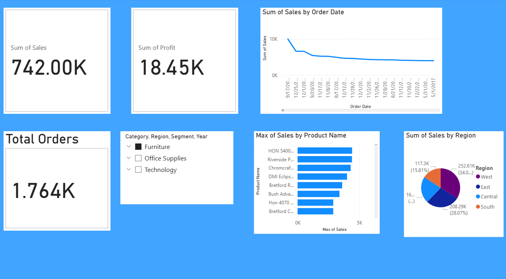

# Power BI Sales Dashboard
This project contains a Power BI dashboard analyzing sales data using the Superstore dataset.

## 🔍 Features
- Total Sales, Profit, and Orders KPIs
- Sales Trends over Time
- Top 10 Products by Sales
- Regional Sales Analysis
- Filters by Category, Region, Segment, and Year

## 📁 Files
- `Superstore_Sales_Analysis.pbix` – Main Power BI file
- `dashboard-preview.png` – Screenshot of the dashboard

## 📊 Tools Used
- Power BI Desktop
- Superstore Dataset (from Kaggle)

## 📸 Preview

## 💡 Dataset Source
[Superstore Sales Dataset on Kaggle](https://www.kaggle.com/datasets/vivek468/superstore-dataset-final)

